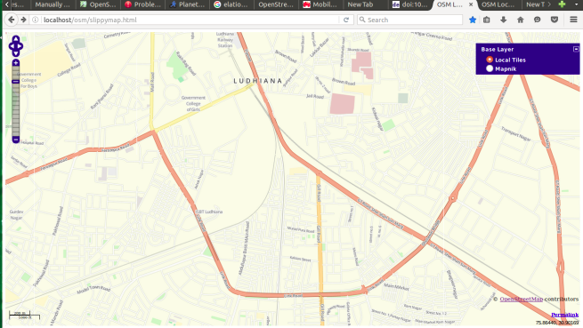
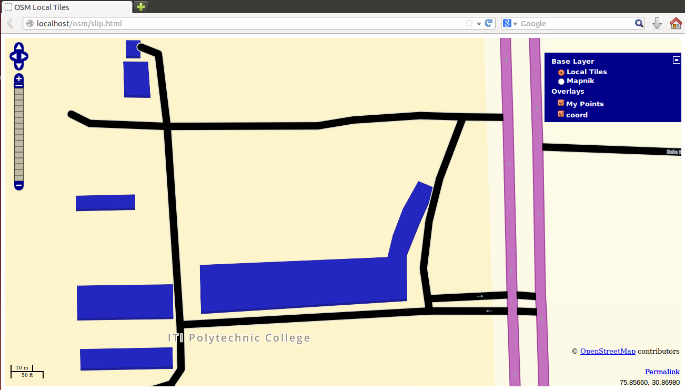
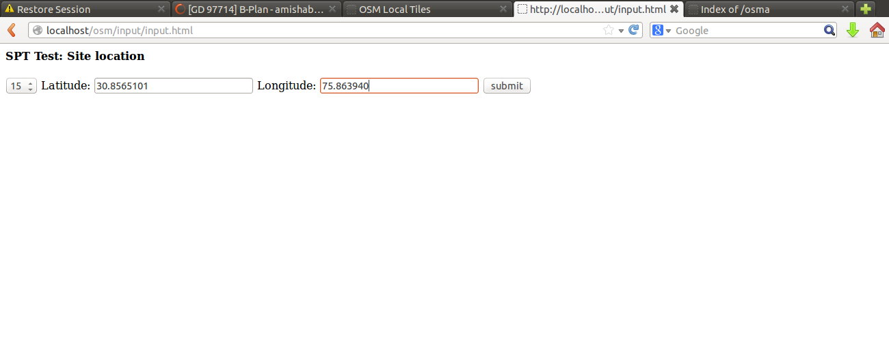
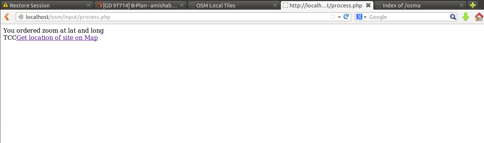
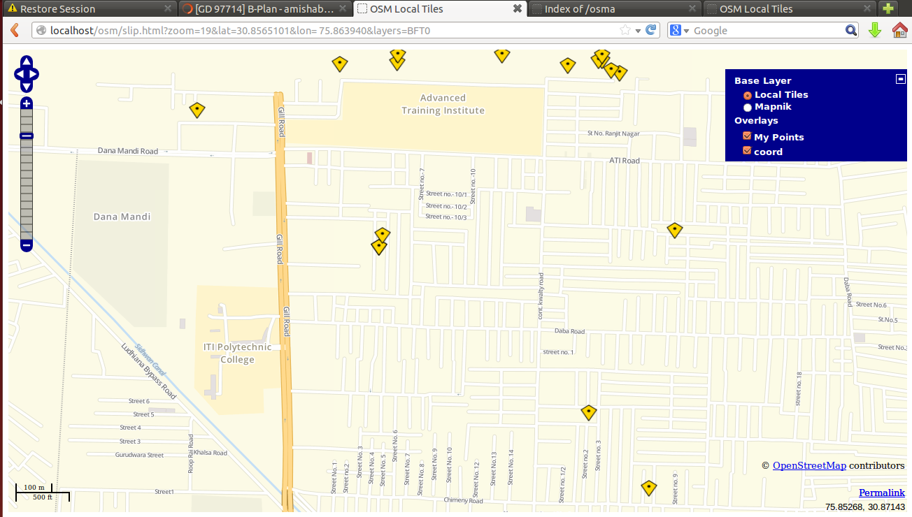
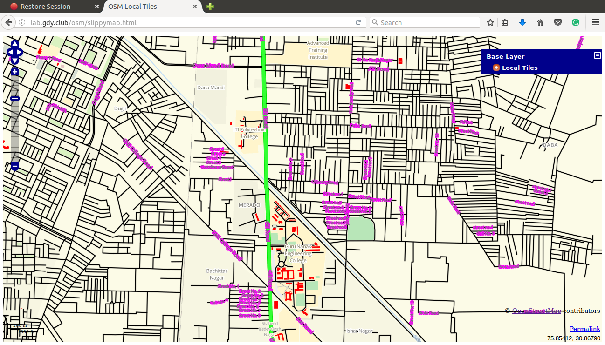
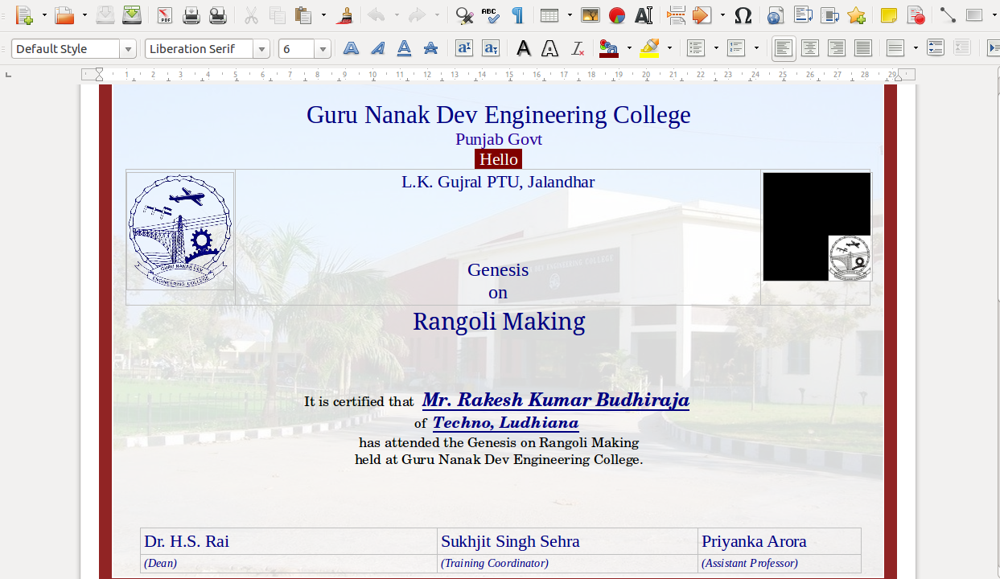

<link rel="stylesheet" href="style.css" type=text/css>
>###PRESENTATION
>ON
>###OpenStreetMap
>##*(OSM)*

----

>##BY-: 
		>###AMISHA BUDHIRAJA
		>###1410808

---

>###Introduction to OSM
 
OpenStreetMap is an open-source,</style> free web-based software, owned by you, the contribu-
tors. It is an online open data platform to collect the world’s geographic data based
on the Wikipedia model of crowdsourcing. The project started in 2004 by Steve Coast and is now
governed by the non profit OSM Foundation based in the UK.

----

>### Aim Of The Project

OpenStreetMap is a free</style> editable map of the whole world. By making your system an OSM tile server you can edit the map offline
also. You can change the functioning and styling of the map like changing colours, font style and many more as
per your requirments.

----

>###Benifits of OSM

1. A full editing history is stored for each user.
2. Provide on-line way to analysis so that individual does not have to install anything.
3. Both techinal and non-technical users can use OSM.
4. User can make own OSM tile server.
5. User can run script for automatic installation.

---

>###TECHNOLOGY USED -:

1. Ubuntu

2. Git

3. LaTeX

4. Opensshserver

5. Reveal-md

----

>###Ubuntu

Ubuntu is a Debian-based Linux operating system,
with Unity as its default desktop environment.
For increased security, the sudo
tool is used to assign temporary privileges for performing administrative tasks.
The terminal is an interface in which you can type and execute text based commands. It is relatively fast.

----

>###Git

Git is a distributed revision control and source code management (SCM) system with an emphases on speed, data integrity, and support for distributed, non-linear work flows.

----

>###LaTeX 

LaTeX, I had never heard about this term before doing this project, but when I came to know about
it’s features, found it excellent. LaTeX is a document
markup language and document preparation system for the TEX typesetting program

----

>###Opensshserver

OpenSSH is a freely available version of the Secure Shell (SSH) protocol family of tools for remotely controlling, or transferring files between, computers. The OpenSSH server sets up a remote control session after authentication. To use SSH, you will need to install an SSH client on the computer you connect from, and an SSH server on the computer you connect to. The most popular Linux SSH client and Linux SSH server are maintained by the OpenSSH project. 

----

>###Reveal-md

Reveal-js is one of the framework of Javascript. This can be used for presentations purpose.Markup languages are designed for the processing, definition and presentation of text. The lan-
guage specifies code for formatting, both the layout and style, within a text file. To enable markdown feature of reveal.js, we need reveal-md. The Markdown feature
of reveal.js is awesome, and has an easy (and configurable) syntax to separate slides.

---

 
>###Implementation

Development of OSM started with development in phases which focus on particular need of project.
Various phases and their detail are given below -:

----

• Phase I (Setup OSM Server) -:
During Phase I, install all the dependecies(components) as mentioned above to make your
own osm tile sever. After installing the softwares download the map in pbf(may be osm)
format and render your own tile server. You can see your map on the browser after moving
to the location which is being downloaded.

---

---

• Phase II (Styling of Map) -:
During phase II, we change the colors of the buildings, roads, primary lines, secondary lines
etc and then rerender the map to view the changes in the map. I have mention which files
needs to be change to proceed furthur in my blog.

---

---

• Phase III (User Input Map) -:
During phase III, we made the html and php pages in which user can input latitude, longitude
and zoom level of his own choice and if the tile image of that location is downloaded then
on one click the map of that particular location will be visible. The functioning is done with
the help of Javascript.

---

---

---

---

• Phase IV (OSM Script) -:
During phase IV, we made OSM installation and configuration script. It is the shell non-
interactive script means user have to change hardly two three parameters inside the script
at the initial stage and then can run the script and can go for having a cup of coffee. The
whole script is on my github account.

----

• Phase V (Event Handling) -:
During phase V, we tried to control the movement of the osm map through the arrow keys of
keyboard and we achieved it. Again it is done with the help of Javascript with the concept of
event handling. Various formulas are being applied and testing have been done while doing
it. The code for the same is on the experimental server. Now, the map can be controlled
through arrow keys also. Isn’t it amazing.

----

• Phase VI (Insert Pop up Menu and Icons) -:
During phase VI, we added textfile containing different attributes like lat, lon, icon etc.
At a particular location(through lat and lon) an icon in the form of image showing some
message(Pop-up menu mostly with the name of shops at that location). The all points can
be disable by disabling the layer ”My Points”.

---

---

• Phase VII (Map On Remote Server) -:
During phase VII, we have added all the things above in the experimental account. It is
done so that everyone can see it and for back up purpose also so that the code and project
retains on other system also.

---

---

• Phase VI (Documentation) -:
During final phase, we enter the project( developers documentation and README.md)
on github and wrote the report for this software.

---

>###Certificate Generation System

Apart from the major project i.e OSM I have done another project ”Certificate Generation Sys-
tem”.
Certificate Generation System is a portable application used to Generate Certificate for single
candidate providing his/her details along with image, As well as for Batch/Number of candidates by
simply providing the CSV format file (containing details of every candidate) along with candidate
images.

---

---

>###Link to OSM -:

http://lab.gdy.club:8088/

>###link on Experimental Server

http://lab.gdy.club:~amisha/

>###link to  blog -:

https://amisha2016.wordpress.com

---

#Queries?

---

# Thank You
